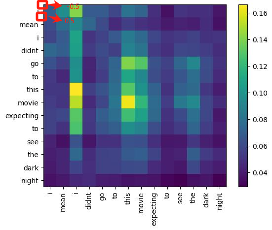

### 训练指令

train.sh 文件下修改运行train.py的参数，如--nothing,--dataset,--fusion_mode

tee：保存命令行的输出结果，结果保存在./trainlog_mosei/mylog.log路径下，-a代表以追加的形式

```bash
bash train_origin.sh --nothing --dataset mosei --fusion_mode inter_intra 2>&1 | tee -a ./trainlog_mosei/mylog.log
```

```bash
bash train_tcp.sh 2>&1 | tee -a ./trainlog_mosei/mylog_tcp.log
```

消融实验

```bash
bash train_origin.sh --nothing --dataset mosei --fusion_mode inter_intra --without_modality t 2>&1 | tee -a ./trainlog_mosei/mylog_wt.log
```


### 可视化指令

**visualize.sh**文件下，可视化注意力机制的结果，通过运行**visualize.py**文件，可指定参数 **--visualize 样本名**，得到对应样本的attention_weight，为一字典类型，包含global（fusion_mode为global时）; inter，intra（fusion_mode为inter_intra时）模型的注意力结果，shape为(layers, bsz, num_heads, q_len, kv_len)

总共涉及到2个文件：visualize.py，model_attenvisualize.py

```bash
bash visualize.sh 2>&1 | tee -a ./visualizelog_mosei/mylog.log
```


### 对齐操作

1. 首先，使用**d\数据集\mosei\raw\audio\full**目录下的whisper_rec.py获取所需要得到time_stamps的音频文件（修改音频路径，存储路径）

2. 接着运行服务器上目录为**/autodl-tmp/alpaca-lora/ljh/code/**下的sim2.py文件，获取得到对齐结果，存储在pkl文件中（修改存储路径）

3. 接着本地对视频（**d\数据集\mosei\load.py**）、音频进行clip（**d\数据集\mosei\clip-audio.py**）（修改存储路径）


### 自训练

基于预训练模型，跑一遍推理；输出csv文件，每类选取top_k个样本（confidence），扩充训练集，重新训练模型，冻结regression头，重新训练p次

首先进行预训练，通过修改模型参数保存路径，保存到指定路径下

```bash
bash train.sh 2>&1 | tee -a ./trainlog_mosei/mylog.log
```

从指定路径下加载模型参数，运行以下指令，会读取/root/autodl-tmp/alpaca-lora/ljh/DPC_KNN/data/ami/ami_audiofilter.csv文件，推理ami数据集，得到伪标签，保存结果在/root/autodl-tmp/alpaca-lora/ljh/code/distill_gate/SFIN_origin/ami_result/ami_pred.csv文件中，运行目录下的analysis.py文件，会得到滤除后的top-10样本的预测，即每个类别选取10个高置信度的样本，最终得到filter_ami_pred.csv文件（以追加的形式），基于该文件重新训练模型，指令的运行顺序如下：

```bash
bash train.sh 2>&1 | tee -a ./trainlog_mosei/mylog.log # 模型参数保存路径指定，每次重新训练路径最好保持不一致
python inf_ami_args.py # 输入ami_audiofilter.csv，模型参数；输出：ami_pred.csv
python analysis.py # 输入：ami_pred.csv 追加的形式输出：filter_ami_pred.csv，同时更新ami_auidofilter.csv,即剩余的未推理的ami样本
bash train.sh 2>&1 | tee -a ./trainlog_mosei/mylog.log # 输入：filter_ami_pred.csv，模型参数保存路径指定，指定为retrain模式
python inf_ami_args.py # 输入ami_audiofilter.csv，模型参数；输出：ami_pred.csv
python analysis.py # 输入：ami_pred.csv 追加的形式输出：filter_ami_pred.csv，同时更新ami_auidofilter.csv,即剩余的未推理的ami样本
```

现在retrain的想法是，val head损失由mosei数据集提供，emo head的损失由mosei+ami数据集提供。


已封装成相关指令，循环自训练的指令

```bash
bash train.sh --nothing --dataset mosei --fusion_mode inter_intra --retrain 2>&1 | tee -a ./trainlog_mosei/mylog.log
```

每次重新自训练前，需要更新初始模型，路径在<u>**model_single/mosei/inter_intramodelf1.pt**</u>中，需更换为初始模型，路径在<u>**model_single_originvideo/mosei/inter_intramodelf.pt**</u>，更换**<u>ami_audiofilter.csv</u>**为初始版本，删除**<u>ami_result/ami_pred.csv</u>**，**<u>ami_result/filter_ami_pred.csv</u>**


### 画图

让坐标轴的label始终对准每一小格的中间，思路：首先得到每一个grid的size，然后获取坐标的起止，让每个刻度都加grid_size/2，终止刻度也要加0.5，传入即可

```python
# 获取横坐标轴的范围
x_min, x_max = plt.xlim()# -0.5 0.5 1.5 2.5 3.5 4.5 5.5 6.5 7.5 8.5 9.5 10.5 11.5 12.5 13.5
# 计算一个小格的长度
grid_size = (x_max - x_min) / len(words) #word为每一小格放置的label
ticks = np.arange(x_min + grid_size/2, x_max + grid_size/2 , grid_size)
```


