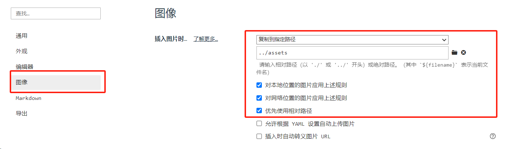

本文总结了在window上基于vuepress搭建个人博客的经历及所踩过的坑。。

最初的设想是先在本地搭建成功之后，再通过github部署，方便个人访问及分享。因此思路主要如下：

step 1: 通过网络搜索教程，熟悉vuepress相关代码及搭建流程，在个人电脑上进行测试。

step 2: 在本地部署成功之后，通过个人的github搭建仓库，以sh命令集成指令，自动化提交到分支。

最终没想到在step 1就耗费了非常多的时间和精力，以下总结相关错误及要点：


要点 1：将exports写成export，导致每次新增区块如侧边栏或者导航栏都得不到想要的效果，耗费过于长的时间

总结 1：代码阅读不够仔细

```json
module.exports = {
}
```


要点 2：网上教程是需要通过npm或者yarn安装vuepress，过程中会出现一些bug，如某些库没有安装。

总结 2：仔细阅读bug，定位关键词，通过搜索工具仔细搜寻，得到解决方案。


要点 3：路径设置的问题，包括[部署到github需要注意的事项](https://www.jb51.net/article/263056.htm)，以及本地搭建是需要对vuepress的路径设置有一定的理解。后者需要阅读 vuepress 官方文档进行准确设置，vuepress 默认会读取该目录下的 README.md 文档，因此每次新建一个文件夹，都需要在该目录下新建一个 README.md：

```json
nav: [
        {text:'首页',link:"/"},//  / 是读取 docs 文件夹下的 README.md 文件，即 / 结尾的路径将会被视为 */README.md
        {text:'about',link:"/about/about"}, // 仅以 / 开头，不写 .md 后缀，默认读取文件夹下对应的 about.md 文件
        {text:'Github',link:"https://github.com/ChosenOne23"}//  跳转链接
        ],
```

总结 3：通过官方文档准确获取信息的能力。


要点 4：将本地搭建好的博客挂载到 github 上的时候，根据网上的构建 deploy.py 教程，一键自动化部署会有相关问题：

```shell
#!/usr/bin/env sh
# myblog/deploy.sh
# 确保脚本抛出遇到的错误
set -e

# 生成静态文件
npm run build  # 此处与 myblog/package.json 中的信息需保持一致，注意：默认情况下一般是npm run build

# 进入生成的文件夹
cd docs/.vuepress/dist

git init
git add -A
git commit -m 'deploy'

# 发布到 https://<USERNAME>.github.io/<REPO>
git push -f git@github.com:ChosenOne23/myblog.git master:gh-pages # 提交到gh-pages分支

cd -
```

```json
// myblog/package.json
{
    ...
    "scripts": {
        "test": "echo \"Error: no test specified\" && exit 1",
        "dev": "vuepress dev docs --temp .temp",
        "build": "set NODE_OPTIONS=--openssl-legacy-provider && vuepress build docs" // 部署时需加上set NODE_OPTIONS=--openssl-legacy-provider
      },
    ...
}
```


要点 5：图片路径设置问题，在typora偏好设置中将图片默认的保存路径设置为../assets，并勾选上以下信息，保证每次插入图片在本地都有存储且方便上传时索引准确。如下：

要点6：为了多设备同步，将现有博客部署到 master 分支下，即 sourch_code.sh 文件。在当前设备更新博客内容后，通过deploy.sh push到 gh_pages 分支，随后将项目源代码也进行更新

```bash
sh .sh # 从github master clone master分支代码
# 更新博客内容
sh deploy.sh # push 到gh_pages，方便访问
sh sourch_code.sh # 从github master分支拉取源代码
```


```bash
# 第一句话，切换到master branch
git checkout master
# 第二句话，新建一个branch来备份本地现有的“旧库”，因为一旦git fetch之后本地的数据都会被覆盖
git branch new-branch-to-save-current-commits
# 第三句话和第四句话就是更新到最新的库（与github上的远程库同步）
git fetch --all
git reset --hard origin/master

# 如果想要回到备份的“旧库”的话。输入：
git branch
# 会列出master和new-branch-to-save-current-commits两个branch。然后输入
git checkout new-branch-to-save-current-commits
# 就会切换到new-branch-to-save-current-commits branch了！
```


yaodian
