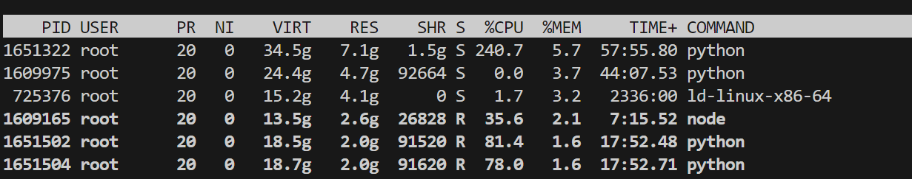

### top

***

top 命令用来查看服务器资源使用情况。命令行输入top，显示结果如下：分别展示了各个进程的内存使用情况；运行时间等信息。

要按照内存从大到小排列则输入: shift+m

输入c,全部显示command列（可能出现部分遮挡的情况，可以适当拖动窗口）

按q退出

### tmux

***

- 较全面的网站：[快捷键网站](https://zhuanlan.zhihu.com/p/90464490)

- 认为常用的：

  - 查看所有会话：tmux ls

  - 新建窗口：tmux new -s <session-name>

  - 分离会话：exit

  - 重新连接会话：tmux at -t <session-name>

  - 切换会话：tmux switch -t <session-name>

  - 杀死会话：tmux kill-sesstion -t <session-name>

- 出现大量...的情况：

​	解决方案：ctrl+b, shift+d选择分辨率最小的：https://blog.csdn.net/qq_16763983/article/details/130450323