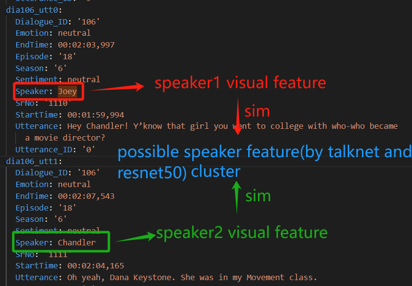
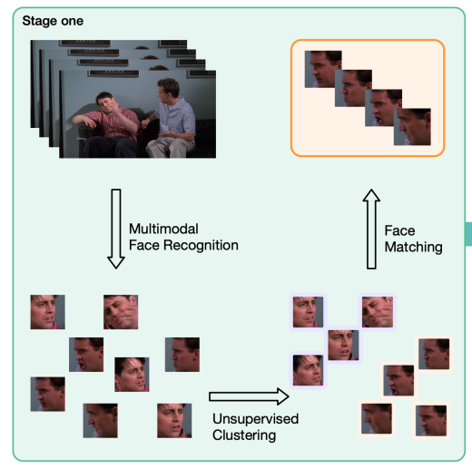
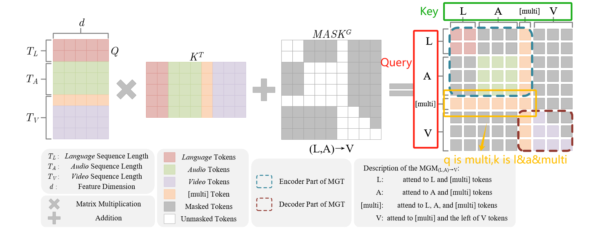
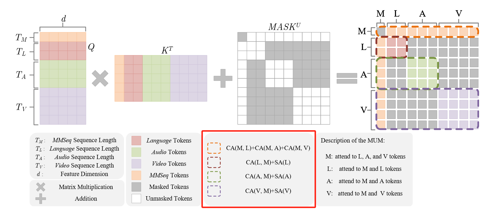
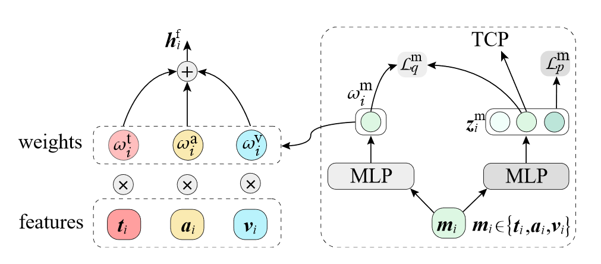

# 阅读的相关论文

### A Facial Expression-Aware Multimodal Multi-task Learning Framework for Emotion Recognition in Multi-party Conversations

***

​	一段视频输入talknet得到可能的说话人的帧序列（有可能是错误的，因此需要后续的匹配操作），将这些帧序列进行聚类，由于meld数据集包含6个不同的说话人，因此，预先从数据集中得到每个人20张不同角度的人脸图片，针对聚类完成得到可能说话人的帧序列，经由resnet-50(pretrained on face recongnition dataset)提取对应的特征，计算相似度得到最终的结果

### EMT_DLFR

***

前向两次，分别得到完整模态，缺失模态的结果

在不同epoch下的同一样本，缺失的time step是一样的。而cutoff则是不一样的。能否在训练时人为构造更多的缺失样本，一方面可以避免过拟合，一方面模拟更多真实世界的缺失模态情况

跨层参数共享，global2local的attention,将注意力的计算降低至线性复杂度

### Robust-MSA

***

端到端的方式；情感词的识别与replace；asr error；语音的背景噪声（人声分离？）；图像中人脸角度，不同光照，人脸缺失，运动模糊

### NIAT

***

三种模态在对齐的情况下，设置了三种不一样的缺失情况：三种模态缺失的位置均不一致（随机位置缺失）；三种模态缺失的位置一致（连续片段缺失，随机位置缺失）

### UniMF

***

提出不同的mask机制，解决未对齐序列缺失模态的问题

图中橘色部分有：
$$
Y_{[multi]} = CA_{L->[multi]}([multi],Z_{L})+CA_{A->[multi]}([multi],Z_{A})+SA([multi])
$$

> 构造两种不同的mask,一种学习模态内部的交互，一种学习模态间的交互。并采用balence策略

### 半监督的paper

***

​	第一篇，关键是balence所生成的样本类别数目，作者对每一类选取top-k置信度的样本，保证了重新训练时样本数量的平衡

- 门控机制

  

### my paper

***

单一视角（intra） vs 多视角（inter）

有的时候，我们仅仅通过单一一种模态，便能做出很好的感情推断，无需其他模态的帮助：

> only inf from text:
>
> 1. a lot of sad parts
> 2. there is sad part

但有时我们需要借助其他模态的帮助(交互信息)从而准确判断主体的情感：

> inf from text and visual:
>
> netural text: AND THERE BUT THEYRE NOT HUGE GLARING FLAWS
>
> negative video: frown
>
> <video src="C:\Users\LinJinhao\Desktop\2WGyTLYerpo_49.mp4"></video>

 

### meta_noise

> 元学习相关资料：https://zhuanlan.zhihu.com/p/72920138，https://zhuanlan.zhihu.com/p/57864886

### mask autoencoder

> https://zhuanlan.zhihu.com/p/439554945

- [离线数据增强与在线数据增强](https://blog.csdn.net/qq_43631827/article/details/124987612)

- [xlnet](https://zhuanlan.zhihu.com/p/70257427)

- top-k准确率的计算

  > https://zhuanlan.zhihu.com/p/340760336

- 项目使用的分类代码

  > https://github.com/bubbliiiing/classification-pytorch

