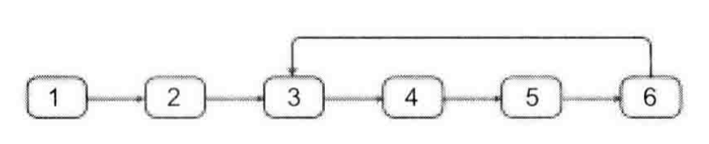
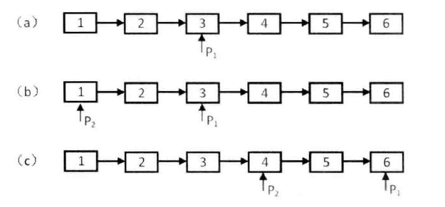
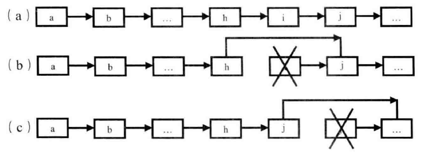
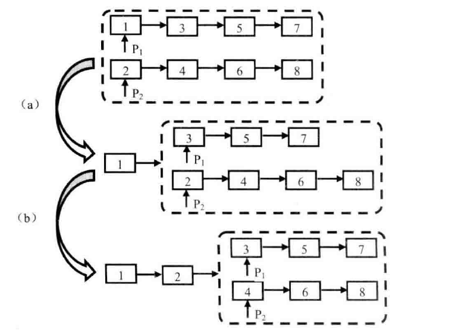

# 算法
### code

***

1. 链表

   > 环的入口节点，如果一链表中包含环，如何确定环的起点
   >
   > 
   >
   > 解法：双指针，通过快慢指针找到处于环中的节点，快指针每次走两步，慢指针每次走一步，由于链表存在环，因此最终肯定会碰上（快的会追上慢的，rectify:快指针多走n步，随后两个指针每次都是走一步），重复的位置就是处于环中的节点。**接着如果快慢指针每次走的步长相差为环的长度的整数倍，则最终必会在入口处碰上**(rectify:初始时，快指针多走环的长度的步长，接着每次都走一步)，问题转化为寻找环的长度的问题，环的长度可以通过单指针实现，在步骤一中得到的起始节点出发，走一遍，并进行计数，最终就能得到环的长度。接着进行步骤二就能找到入口节点。

***

> 链表中倒数第K个节点
>
> 解法：双指针，快指针初始多走k（**k-1**）步，接着每次都走一步，快指针到终点时，慢指针刚好指向倒数第k个节点。
>
> 

***

> 调整数组顺序使奇数位于偶数前面
>
> 解法：双指针，奇偶（分别向中心移动），奇奇（**while到奇数**左指针+1），偶偶（右指针-1），偶奇（交换）
>
> 2，1，4，5，3
>
> 3，1，4，5，2
>
> 3，1，5，4，2


***

> - 删除链表的节点：给定单向链表的头指针和一个节点指针，定义一个函数在O(1)时间内删除该节点
>
>
> 解法：有了要删除的节点指针，可以知道该节点的下一个节点，把下一个节点的值赋值给要删除的节点，将当前节点的next指向下下个节点，**除此之外还需要把待删除节点指向的下一个节点删除**。倘若在尾部，只能顺序查找删除
>
> 
>
> 时间复杂度的分析
>
> ((n-1)*O(1)+O(n))/n=O(1a)
>
> - 删除已排序链表中重复的节点
>
> 双指针

***

> 打印从1到最大的n位数
>
> 常规做法会出现越界问题，考点是字符串的数字加法及终止条件的判定


***

> 数值的整数次方
>
> 解法：先举例子 

***

> 二进制中1的个数
>
> 解法：输入的二进制数与0001进行与运算，若为1则说明最低位存在1，接着左移一位，得到0010，即与输入的二进制数的次低位进行与运算，判断次低位是否为1，以此类推

***

> 反转链表
>
> 解法：由于当前节点和下个节点的顺序反转后，链表出现了断裂，即下个节点与下下个节点之间的链接出现断裂，因此需要记录三个节点的信息，
>
> ```
> prev_node = nullptr
> while(p->node!=nullptr)
> {
> next_node = p->node->next
> p->node->next = prev_node
> prev_node = p->node
> p->node = next_node
> }
> ```

***

> 合并两个排序链表
>
> 解法：比较两个链表头节点的大小，将小的一个作为合并后链表的头节点，接着继续合并链表中的剩余节点
>
> 
>
> ```
> mergehead
> if phead1->value < phead2->value:
> 	mergehead=phead1
> 	mergehead=
> ```


***

> 树的子结构


**

> 二叉树的镜像


#### 反转链表I

1. 示例：[1->2->3->4->5] --> [5->4->3->2->1]

2. [题解](https://leetcode.cn/problems/reverse-linked-list/solution/206-fan-zhuan-lian-biao-shuang-zhi-zhen-r1jel/)

```python
curr,prev = head,None
while curr: # not null
    tmp=curr.next
    curr.next=prev
    prev=curr
    curr=tmp 
return prev # 迭代结束, prev 以及 curr 成为反转链表的头节点以及尾节点
```


#### 反转链表II

反转链表某一区间：[1->2->3->4->5] --> [1->4->3->2->5]

思路1：

```python
left,right
while left<right:
    tmp=l.val
    l.val=l.next.val
    l.next.val=tmp
    l=l.next
    left+=1
```

但是，机试时一般不允许修改节点的值。因此只能通过修改节点指向改变。

思路2：

将需要反转的区间从原链表内截断出来，反转完成后再连接起来

[1->`2->3->4`->5] 2,4

截断+反转：[1 `2<-3<-4` 5]

拼接： [`1->4`->3->`2->5`]

```python
def reverselistnode(l):
    curr,prev=l.head,None
    while curr:
        tmp=curr
        curr.next=prev
        pre0v=curr
        curr=tmp
    return prev

r_tail_prev=l1.head
for _ in range(left-2):
    r_tail_prev=r_tail_prev.next
r_head=r_tail
for _ in range(right-left):
    r_head=r_head.next
    
# 截断
r_tail_prev.next=None
r_head.next=None

# 反转
reverselistnode(r_head)
r_tail_prev.next=prev
r_head.next=curr
```


#### 删除链表的倒数第n个节点

[1,2,3,4,5] --> [1,2,3,5] n=2

添加哑节点，因为如果要删除的是头节点，需要知道头节点的前驱，将前驱的后继改为前驱的后继的后继，因此添加哑节点就只需要考虑通用情况。

思路1：通过链表长度，得到倒数第`n`个节点的前驱。由于到达倒数第`n`个节点需要知道链表的长度，因此需两次遍历。

```python
def getlength(l):
    length=0
    while l:
    	l=l.next
    	length+=1
    return length
length=getlength(l)
l=Listnode(0,head)# 添加哑节点
for _ in range(length-n)
	del_prev=del_prev.next
del_prev.next=del_prev.next.next
```


思路2：双指针，初始时，快指针先走`n`步，慢指针仍处于头节点，之后每次二者都只走一步，当快指针到达尾节点时（为空时），慢指针就到了倒数第`n`个节点。

[`1`,2,`3`,4,5,null] n=2

[1,2,3,`4`,5,`null`] # 但是我们要的是待删除节点的前一个结点

因此添加哑节点：[==0==,1,2,3,4,5,null]

初始时慢指针指向哑节点，快指针指向头节点，随后多走`n`步：

[`0`,1,2,`3`,4,5,null] [0,1,2,`3`,4,5,`null`]


#### 链表已排序，删除重复元素

[1,2,3,3,4,4,5]

如果题目存在需删除或修改头节点的情况，此时添加哑节点。

[==dummy_node==,`1`,`2`,3,3,4,4,5,null] 

```python
dummy=ListNode(0,head) # 添加哑节点
cur=dummy
while cur.next and cur.next.next: # cur.next存在，但是cur.next.next已经到达null。此时无需删除了，肯定不是重复的
    if cur.next.val == cur.next.next.val: # 说明当前cur的后两项重复，都需要删除
    	tmp=cur.next.val # 记录重复项
        while cur.next and cur.next.val == tmp: # 将cur的下一个元素删除，此时cur为2
            cur.next=cur.next.next # 循环过程：2指向第2个3，2指向4
    else:
    	cur=cur.next
return dummy.next

```


#### 旋转链表

> 示例：原始序列:[1,2,3,4,5]
>
> k=1,[5,1,2,3,4] k=2,[4,`5,1`,2,`3,null`]

[==1==,2,`3`,==4==,5,`null`] k=2

- `k=2` 时, 找倒数第 `k+1=3` 个节点(3,tail_k_prev), 最终要使得倒数第`3`个节点(3)的后继为 `null`, 尾节点(5)的后继为 `head`。

- 寻找tail_k_prev: (倒数第 k 个节点的前驱)

  快指针在第 ==4== 个节点, 慢指针在第一个节点, 后续快慢一致, 就可以得到 `tail_k_prev`。

- 考虑 `k>len(listnode)` 的情况:

  [1,2,3,4,5] `k=5` 时, 不变; `k=6` 时与 `k=1` 时情况一致。因此 k = k % len(listnode)

```python
def lastknode(k):
    slow,fast = head,head
    for _ in range(k):
        fast = fast.next
    while fast:
        slow = slow.next
        fast = fast.next
    return slow
# 找到尾节点
tail=head
length=0
while tail.next:
    tail=tail.next
    length++
k=k % length
tail_k_prev = lastknode(k+1)
cur=tail_k_prev.next
tail.next=head
tail_k_prev.next=null
return cur
```


#### 分隔链表 

> [1,4,3,2,5,2], x=3
>
> [1,2,2,4,3,5]

[题解](https://leetcode.cn/problems/partition-list/solution/86-fen-ge-lian-biao-shuang-zhi-zhen-qing-hha7/)

```python
    sml_dummy,big_dummy=ListNode(0),ListNode(0) # 新建两个链表
    sml,big=sml_dummy,big_dummy
    while head:
        if head.val <= x:
            sml.next=head
            sml=sml.next
        else:
            big.next=head
            big=big.next
        head=head.next
    sml.next=big_dummy.next
    big.next=null
return sml_dummy.next
```


群体节点：0

个体节点：1，2，3   1与2相邻

[`[1，1，1，1]`

 [`1`，1，1，0]

 [`1`，1，1，0]

 [`1`，0，0，1]]