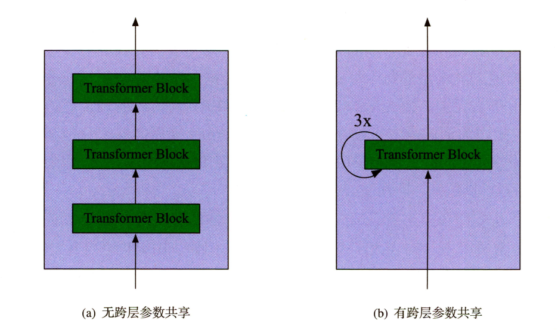
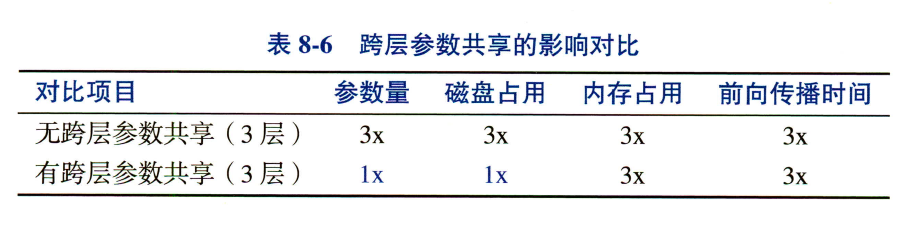
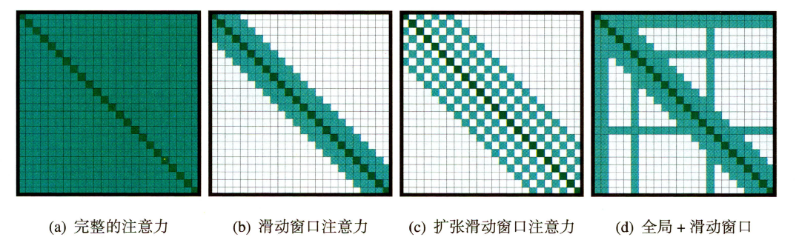
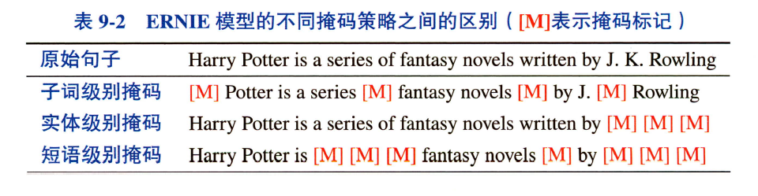
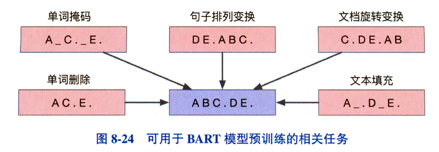
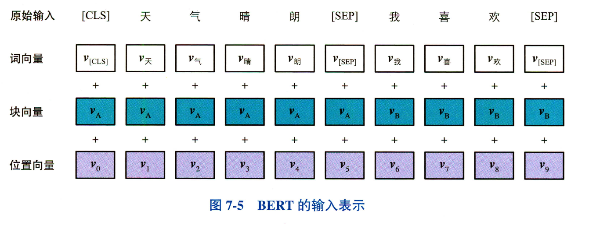

# 深度学习相关知识

***

1. 跨层参数共享

   

> 优点：需保存的参数量降低，减少存储成本。减少训练时间
>
> 缺点：推理时间仍然一样

> 共享不同参数层的结果

2. 词向量因式分解

   > 引入一全连接层，将词向量维度降维，达到降低transformer中隐层维度的目的

3. 渐进式知识蒸馏

   > MobileBERT:学生模型开始学习教师模型的第一层，接下来学习教师模型的第二层，而此时学生模型的第一层权重是不参与更新的。依此类推。

4. 注意力机制的改进（longformer）

   > - 滑动窗口注意力
   >
   >   当前token仅与左右k/2个token窗口内的token计算注意力
   >
   > - 扩张窗口注意力
   >
   >   在窗口内不是与所有token计算注意力而是进行采样，与窗口内被采样到的token计算注意力（采样间隔）
   >
   > - 全局+滑动窗口
   >
   >   将QKV映射两种不同的子空间，这两种不同的QK,分别计算全局（与具体任务有关，如具有全局视角的CLS，则该token可以关注其他所有token的信息）和滑动窗口注意力

### idea

***

1. 缺失模态下的情感分析

> 首先，预训练，基于MLM策略（动态掩码（Robeta）/静态掩码）
>
> 接着，基于预训练好的的重建模型，提取特征，模态融合模块，进行情感预测

2. 相关的掩码策略（NLP，BART）

- 单词掩码，在输入文本中随机采样一部分单词，并且替换为掩码标记如[MASK]

- 单词删除，随机采样一部分单词并且删除。在预测缺失单词的同时还需要确定缺失单词的位置

- 句子排列变换。将多个句子的顺序随机打乱

- 文档旋转变换

- 文本填充

- 实体级别掩码，在普通的单词掩码中，模型只需要根据J.与Rowling就可以做出正确的预测，而无法学习到更高层次的语义

  

  

3. 门控策略

- 输入信号经非线性变换映射至[0,1]，得到门控向量，与原始输入进行元素点乘

  

4. bert相关

- 词向量编码，块编码，位置编码

  > 词向量编码由独热向量经由词向量矩阵（可学习参数矩阵）映射得到
  >
  > 块编码指的是当前token属于哪一句子，属于句子0则编码为0，属于句子1则编码为1，以此类推。运用块向量矩阵进行映射得到最终的块编码
  >
  > 位置编码则是将按单词顺序转换为独热编码，再经由位置向量矩阵转换为位置编码

  

- MLM实现

  在得到掩码位置的隐向量后，经由词向量矩阵，映射到词表空间，之后经softmax操作得到词表中的词对应该掩码位置的概率，取max即为预测的单词，模型对第i个掩码位置的预测概率的计算如下：
  $$
  P(i)=Softmax(h_{i}W_{}^{T}+b)
  $$

  > 整词掩码：掩码的最小粒度为单词级而非wordpiece级，提升了mlm任务的难度，模型在预测掩码词时，需要更多依靠上下文信息，有助于提升模型对输入文本语义信息的挖掘
  >
  > 需要注意的是，整词掩码中，子词的掩码方式可以是替换为[MASK]，随机词或者保留原词，三选一；各个子词均会受到掩码；掩码的方式受到概率控制

- 下游任务

  抽取式阅读理解：将问题和篇章输入至模型，问题在前，篇章在后，篇章超过最大允许输入长度时，分段输入。在获取得到每个位置起点、终点位置的概率，分别取top-k个，假设起点终点位置相互独立，则联合概率为二者相乘，得到一个[start,end,prob]的三元组，数量为k*k个，添加限制条件start<end，筛选得到最终的结果。

